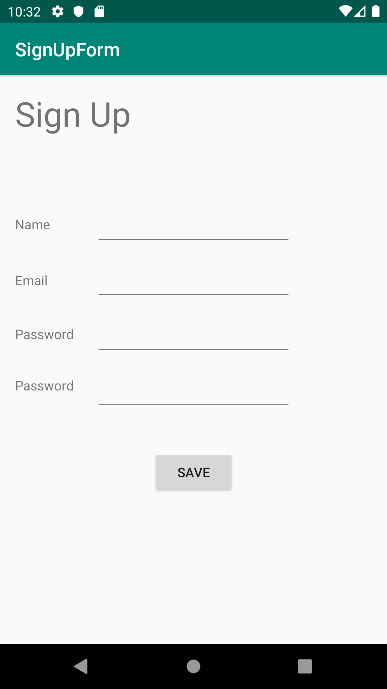

README
~~~~~~

    This is a simple application which takes as input a user's name, email, password, and a password
confirmation to compare to the first password, as if the user is making an account in the
application. It isn't really though. When the user hit's save, a toast message appears. If any
fields are missing, it will warn the user. If the passwords are not matching, the user will be
alerted as well. If all is well, then the message will simply welcome the user, using the name in
the first input field. 

